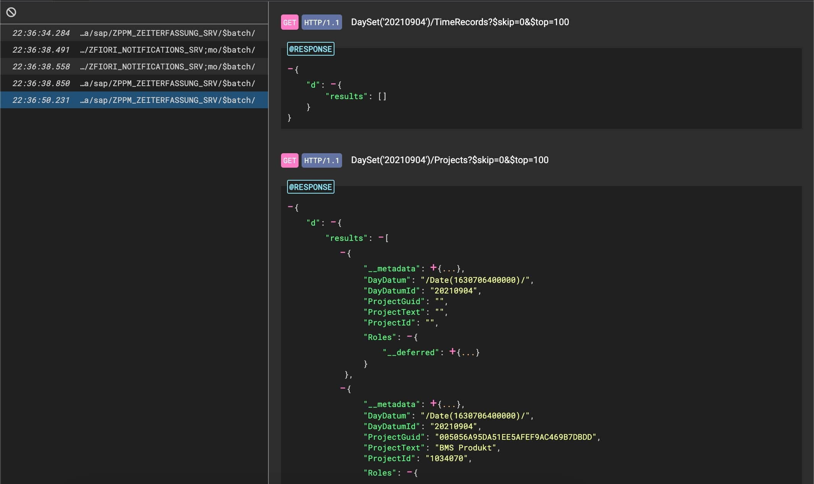

<h1 align="center">
   
  
   
  OData Batch Viewer
   
</h1>

  <a href="#manual-installation">Manual installation</a> •
  <a href="#to-do">To Do</a> •
  <a href="#credits">Credits</a>

This is an extension for the Chrome Dev Tools. It adds a new panel that will present the OData batch requests of the current page in a structured and accessible way. This allows you to debug batch requests much faster.

## Manual installation

1. Open the Extension Management page by navigating to `chrome://extensions`.
    * Alternatively, open this page by clicking on the Extensions menu button and selecting Manage Extensions at the bottom of the menu.
    * Alternatively, open this page by clicking on the Chrome menu, hovering over More Tools then selecting Extensions
2. Enable *Developer Mode* by clicking the toggle switch next to *Developer mode*.
3. Click the *Load unpacked* button and select the extension directory.

## To Do

* [x] Add sticky header to master view
* [x] Add "delete all entries" function to sticky header
* [x] Change master layout to mimic "Network" tab (no bottom-border, instead use different bg-color for every other row, blueish hover color, blue select color)
* [x] Change font-size/family of master view (maybe roboto mono?)
* [x] Add color scheme for light mode
* [x] display requests with error response (response code is 400+)
* [x] display body of POST/PUT request
* [x] display label "request/response" before json
* [x] add license
* [x] switch to modern modules https://javascript.info/modules-intro
* [x] "req/resp" label shouldn't go away when scrolling horizontally (introduce nested divs for renderjson box?)
* [x] add icons to manifest
* [ ] display requests where atomic requests failed (response code is 200+)
* [ ] migrate to company git
* [ ] publish extension
* [ ] make SAP blog post
* [ ] open atomic GET request in a new tab
* [ ] rerun atomic requests (click on the path of the response to run this request again)
* [ ] make extension available in Firefox/Edge
* [ ] encoding of special chars in responses seems broken

## Credits

* Logo made by [Pixelmeetup](https://www.flaticon.com/authors/pixelmeetup) from [https://www.flaticon.com/](www.flaticon.com).
* Icons made by [FontAwesome](https://fontawesome.com/)
* JSON rendered by [renderjson](https://github.com/caldwell/renderjson).
* XML transformed by [xml2json](https://github.com/enkidoo-ai/xml2json).